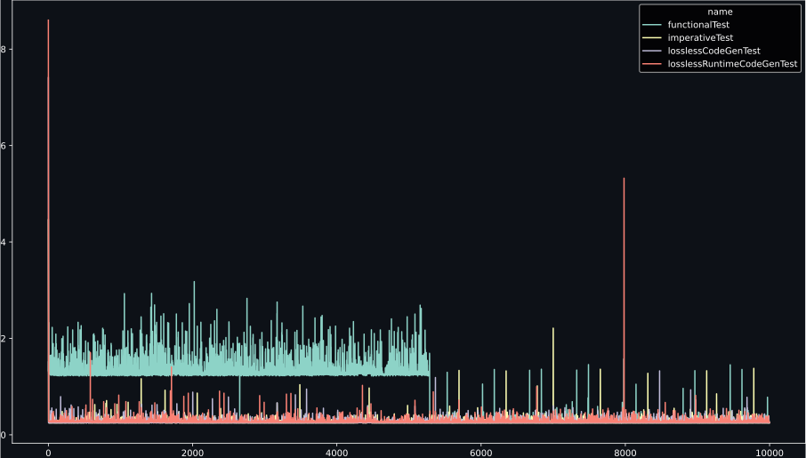

# Benchmarking map/filter/reduce on node.js

Preliminary results:

Results after steady-state:
```
                         mean       std       min       max          sum
functionalTest       0.136873  0.014349  0.128402  0.481166   547.353705
imperativeTest       0.146490  0.024147  0.143332  1.134306   585.960489
losslessCodeGenTest  0.156201  0.023248  0.153822  1.008154   624.802734
losslessTest         0.629291  0.025270  0.622429  1.338149  2517.164927
```

Results of the full run:
```
                         mean       std       min       max          sum
functionalTest       0.492791  0.336440  0.128402  1.169906  4927.418061
imperativeTest       0.146909  0.034266  0.143322  2.562827  1469.085322
losslessCodeGenTest  0.156721  0.038408  0.153782  2.318833  1567.211192
losslessTest         0.637104  0.043760  0.619658  3.392149  6371.042453
```

